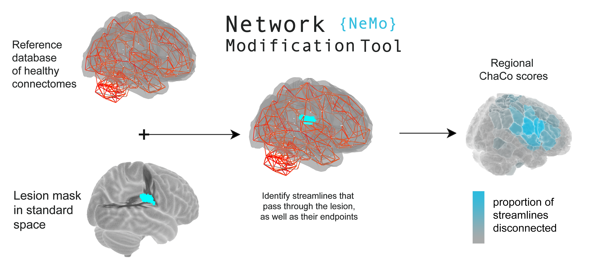

# Predicting chronic motor scores from lesion data.


## Getting Started
The machine learning pipeline, which includes data formatting and model evaluation, can be found in [pipeline](pipeline)

Requirements:
```
matplotlib==3.3.4
numpy==1.20.1
pandas==1.2.4
scikit_learn==1.1.3
scipy==1.6.2
```

## Usage

Instructions for how to use the project, including any necessary command line arguments or input files.


If you want to contribute to the project, please follow these guidelines:

- Fork the repository
- Create a new branch for your changes
- Make your changes and commit them to your branch
- Submit a pull request for your changes to be reviewed and merged

## License

Include information about the license of the project, such as which open source license it is released under.

This repository contains code to predict chronic motor scores from lesion data.


# Contents

1. [Predicting motor scores from M1-CST-LL](#m1-lesion-load)
2. [Predicting motor scores from CST-LL](#smatt-cst-lesion-load)
3. [Predicting motor scores from estimated structural disconnection](#estimate-structural-disconnection)


# M1 lesion load

Calculate the lesion load on the corticospinal tract originating from ipsilesional M1. 
Template: [Sensorimotor Area Tract Template (SMATT)](http://lrnlab.org/)
Calculated as the number of lesioned voxels that intersect with the ipsilesional M1-CST.


# SMATT CST lesion load

Calcualte the lesion load on all ipsilesional corticospinal tracts originating from M1 (primary motor cortex), S1 (sensorimotor cortex), SMA (supplementary motor area), pre-SMA (pre-supplementary motor area), ventral premotor cortex (PMv), and dorsal premotor cortex (PMd).
Calculated as the proportion of lesioned voxels that intersect with each ipsilesional tract.

Template: [Sensorimotor Area Tract Template (SMATT)](http://lrnlab.org/) 

Code:

- MATLAB: SMATT_lesion_load.m (requires FSL)
- python: SMATT_lesion_load.ipynb (uses nibabel)

# Estimate structural disconnection

The Network Modification Tool [NeMo 2.1](https://kuceyeski-wcm-web.s3.us-east-1.amazonaws.com/upload.html) can be used to estimate regional or pairwise change in connectivity (ChaCo) scores, given a binary lesion mask.

## Contributing

If you want to contribute to the project, please follow these guidelines:

- Fork the repository
- Create a new branch for your changes
- Make your changes and commit them to your branch
- Submit a pull request for your changes to be reviewed and merged

